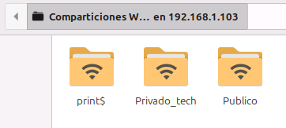
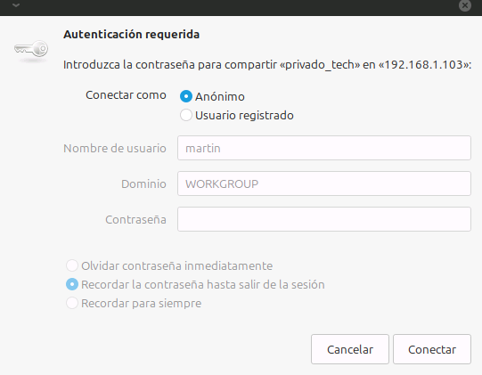

# Servidor de Archivos con Samba

## 1. Descripción del Proyecto

Este proyecto consistió en la configuración de un servidor de archivos en Ubuntu Server 24.04 utilizando Samba. El objetivo era crear un recurso de red centralizado, similar a una unidad de red de Windows (NAS), para compartir archivos de forma segura dentro de una red local.

Se implementaron dos tipos de carpetas compartidas con diferentes políticas de acceso para simular un caso de uso realista: una carpeta pública con acceso de escritura restringido y una carpeta privada de usuario.

**Tecnologías Utilizadas:**
*   **Sistema Operativo:** Ubuntu Server 24.04 LTS
*   **Software de Servidor de Archivos:** Samba
*   **Herramientas de Red y Seguridad:** UFW (Uncomplicated Firewall)
*   **Cliente de Red:** Nemo (Gestor de archivos de Linux Mint)

---

## 2. Pasos de la Implementación

### a) Instalación y Configuración del Firewall
El primer paso fue instalar el paquete de Samba (`sudo apt install samba`) y configurar el firewall `UFW` para permitir el tráfico de red necesario con el comando `sudo ufw allow 'Samba'`.

### b) Creación de Directorios y Permisos del Sistema
Se crearon los directorios a compartir en `/srv/samba/` y se establecieron los permisos de sistema de archivos de Linux para controlar el acceso a nivel de sistema operativo.
*   Se creó un grupo `sambashare` para gestionar los permisos de escritura en la carpeta pública.
*   Se asignó la propiedad de la carpeta privada al usuario `tech`.

### c) Gestión de Usuarios de Samba
Se añadió el usuario `tech` a la base de datos de contraseñas de Samba utilizando `sudo smbpasswd -a tech`, ya que Samba gestiona sus propias credenciales de forma independiente al sistema.

### d) Configuración de las Carpetas Compartidas
Se modificó el archivo de configuración principal `/etc/samba/smb.conf` para definir las carpetas a compartir. El siguiente fragmento de código, añadido al final del archivo, define las reglas para cada carpeta:

```ini
[Publico]
comment = Carpeta publica para todos
path = /srv/samba/publico
browseable = yes
guest ok = yes
read only = no
write list = @sambashare

[Privado_tech]
comment = Carpeta privada para el usuario tech
path = /srv/samba/privado_tech
browseable = yes
read only = no
valid users = tech
```

La configuración fue verificada con el comando testparm antes de reiniciar los servicios de Samba.

### e) Resultado Final

Finalmente, se estableció la conexión desde una máquina cliente (Linux Mint) a través de la red, accediendo a smb://192.168.1.103. El resultado fue el acceso exitoso a las dos carpetas compartidas.





## 3. Retos y Aprendizajes

El principal desafío en este proyecto fue comprender la doble capa de permisos:

* Permisos del sistema de archivos de Linux: Samba no puede otorgar un acceso que el sistema operativo subyacente prohíbe.

* Permisos de Samba: Las directivas en smb.conf definen cómo se exponen esos permisos a través de la red.

Este proyecto fue fundamental para entender la gestión de usuarios, grupos y permisos en un entorno de red, una habilidad clave para cualquier administrador de sistemas.